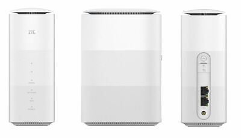
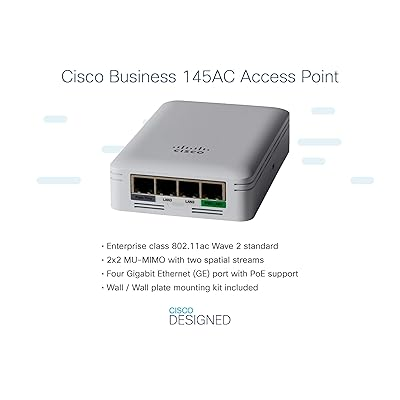
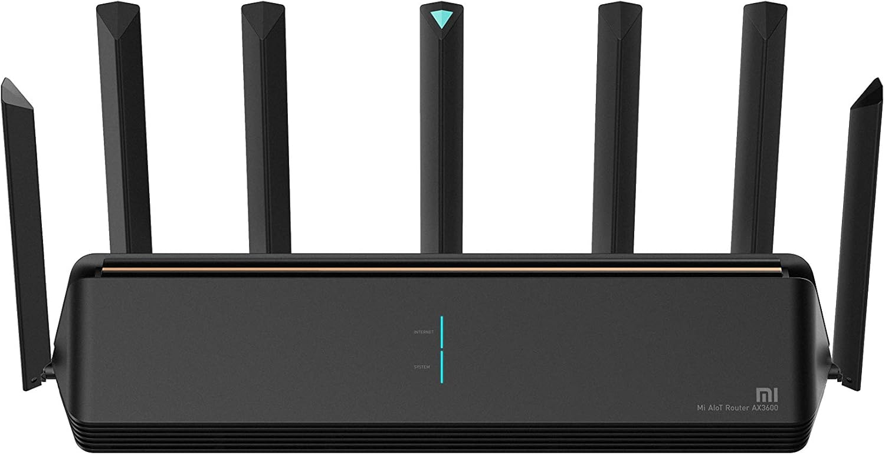

**_TP-Link Archer AX53_**

El router TP-Link Archer AX53 te ofrece una conexión ultrarrápida de hasta 3 Gbps, ideal para disfrutar de streaming en alta calidad y gaming sin interrupciones. Además, su potente procesador de doble núcleo permite manejar varias tareas que requieren mucho ancho de banda al mismo tiempo, asegurando una experiencia fluida y sin retrasos. 🚀📶

**_ZTE 5G CPE MC801A_**

El router TP-Link Archer AX53 es una excelente opción si buscas una conexión rápida y estable. Ofrece velocidades de hasta 3 Gbps, lo que lo hace ideal para ver contenido en alta definición, jugar en línea sin retrasos y descargar archivos grandes sin interrupciones.

Además, cuenta con un potente procesador de doble núcleo, que le permite manejar varias conexiones al mismo tiempo sin perder rendimiento. Esto significa que puedes tener varios dispositivos conectados (como teléfonos, computadoras y consolas) sin que la velocidad se vea afectada.

**_Punto de acceso Cisco Business 140AC 802.11ac 2×2_**

Cisco Business ofrece herramientas de administración de redes tanto en web como en dispositivos móviles, lo que permite configurar todo en pocos minutos. Esto hace que la gestión de la red sea más sencilla y eficiente, ahorrando tiempo y recursos que pueden destinarse al crecimiento del negocio.

Además, cuenta con seguridad integrada, incluyendo Cisco Umbrella, que ayuda a prevenir brechas de seguridad costosas y protege la privacidad de los datos.

En resumen, es una solución confiable y fácil de usar que permite a las empresas enfocarse en lo realmente importante: crecer y ser más rentables. 🚀🔐

**_Xiaomi mi AIOT router AX3600_**

Este router ofrece altas velocidades de Wi-Fi, alcanzando hasta 2402 Mbps en la banda de 5 GHz y 574 Mbps en la banda de 2.4 GHz. Esto permite una conexión rápida y estable, ideal para streaming, videojuegos en línea y descargas pesadas.

Además, incorpora tecnologías avanzadas como OFDMA y MU-MIMO, que mejoran el rendimiento en entornos con muchos dispositivos conectados al mismo tiempo. Su potente chip Qualcomm de 6 núcleos (4 núcleos para la CPU y 2 para la NPU) garantiza un funcionamiento fluido, incluso cuando hay múltiples conexiones activas.

Para una mejor cobertura, cuenta con 6 antenas externas y amplificadores de señal, asegurando que el Wi-Fi llegue a cada rincón de tu hogar.

En resumen, este router es una excelente opción si buscas velocidad, estabilidad y una conexión potente en toda tu casa. 🚀📶

