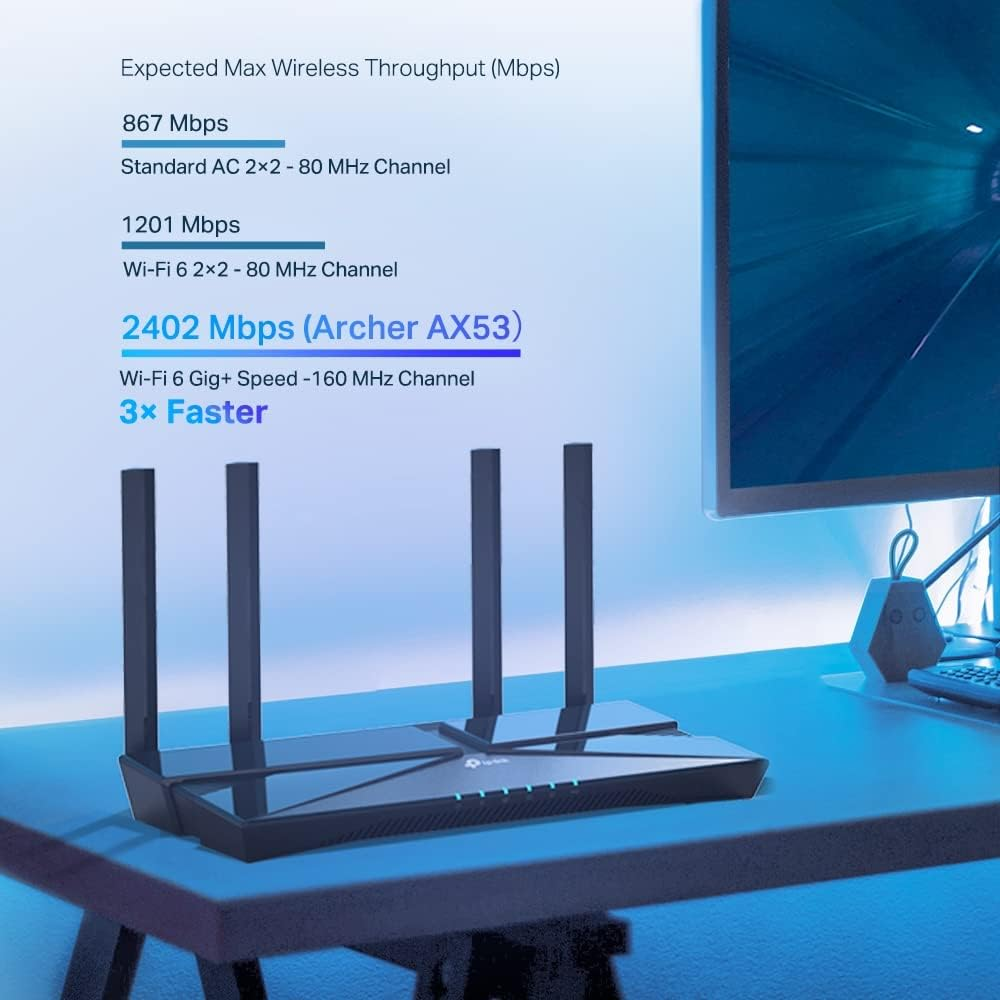

**_TP-Link Archer AX53_**

El router TP-Link Archer AX53 te ofrece una conexión ultrarrápida de hasta 3 Gbps, ideal para disfrutar de streaming en alta calidad y gaming sin interrupciones. Además, su potente procesador de doble núcleo permite manejar varias tareas que requieren mucho ancho de banda al mismo tiempo, asegurando una experiencia fluida y sin retrasos. 🚀📶

